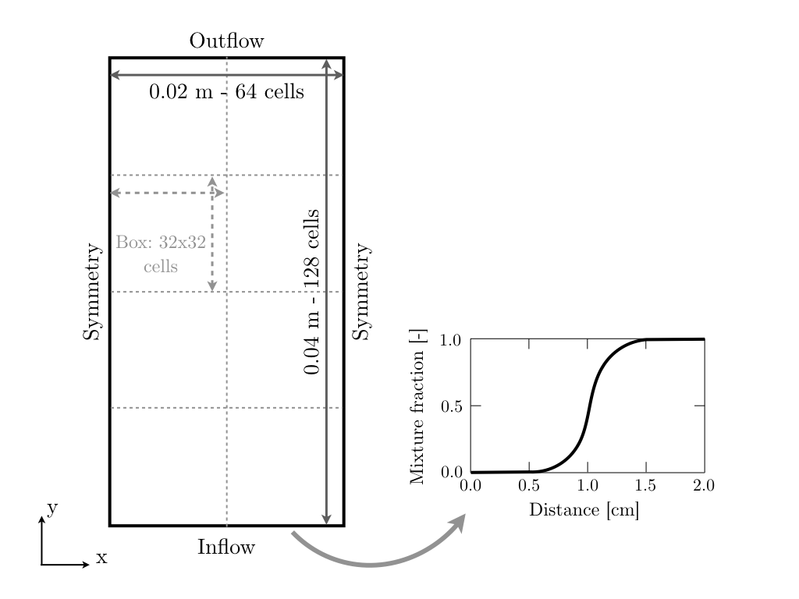
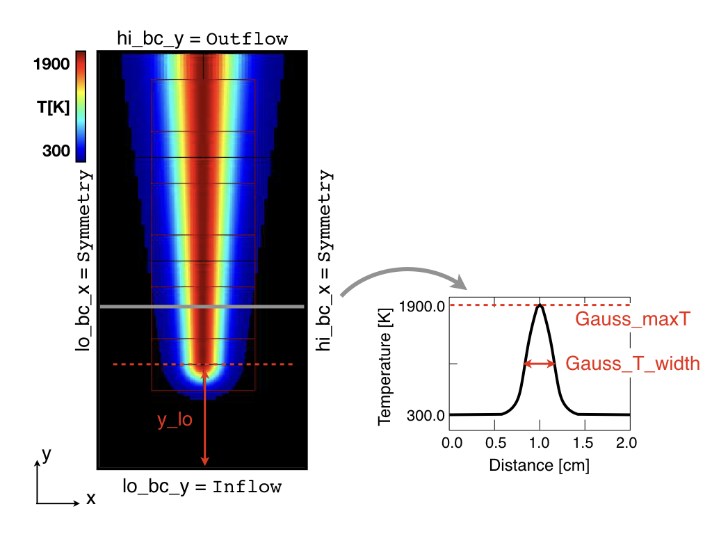
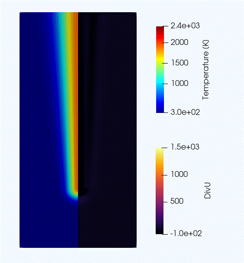
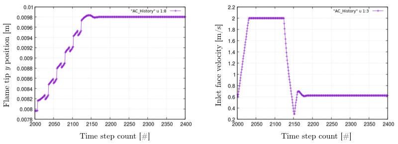

.. highlight:: rst

.. _sec:tutorial1:

Tutorial - A simple triple flame
===============================

.. _sec:TUTO1::Intro:

Introduction
------------------------------

Laminar flames have the potential to reveal the fundamental structure of combustion 
without the added complexities of turbulence. 
They also aid in our understanding of the more complex turbulent flames. 
Depending on the fuel involved and the flow configuration, the laminar flames can take on a number of interesting geometries. 
For example, as practical combustion systems often operate in partially premixed mode,
with one or more fuel injections, a wide range of fresh gas compositions can be observed; 
and these conditions favor the appearance of edge flames, see Fig. :numref:`fig:TripleFlameIntro`. 

.. |a| image:: ./Visualization/TripleFlame_C2H4300.png
     :width: 100%

.. _fig:TripleFlameIntro:

.. table:: Normalized heat release rate (top) and temperature (bottom) contours of two-dimensional (2D) laminar lifted flames of ethylene.
     :align: center

     +-----+
     | |a| |
     +-----+

Edge flames are composed of lean and rich premixed flame wings usually surrounding a central
anchoring diffusion flame extending from a single point [PCI2007]_. Edge flames play
an important role in flame stabilization, re-ignition and propagation.
Simple fuels can exhibit up to three burning branches while diesel fuel, with a low temperature combustion mode, 
can exhibit up to 5 branches.

The goal of this tutorial is to setup a simple 2D laminar triple edge flame configuration with `PeleLM`. 
This document provides step by step instructions to properly set-up the domain and boundary conditions, 
construct an initial solution, and provides guidance on how to monitor and influence the initial transient to reach
a final steady-state solution. 
In a final Section, post-processing tools available in `PeleAnalysis` are used to extract information about 
the triple flame.

..  _sec:TUTO1::PrepStep:

Setting-up your environment
---------------------------

PeleProduction
^^^^^^^^^^^^^^^^^^^^^^^^^^^^^^^^^^^^^
As explained in section :ref:`sec:QUICKSTART`, `PeleLM` relies on a number of supporting softwares: 

- `AMReX` is a software frameworks that provides the data structure and enable massive parallelization.
- `IAMR` is a parallel, adaptive mesh refinement (AMR) code that solves the variable-density incompressible Navier-Stokes equations.
- `PelePhysics` is a repository of physics databases and implementation code. In particular, the choice of chemistry and transport models as well as associated functions and capabilities are managed in `PelePhysics`.

All of these codes have their own development cycle, and it can make the setup of a `PeleLM` run a bit tricky.
To simplify the process, `PeleProduction <https://github.com/AMReX-Combustion/PeleProduction>`_ will be employed. `PeleProduction` is a collection of run folders for various `Pele` codes and processing. It includes git submodules for the dependent codes 
(such as `PeleLM`, `PelePhysics`, `AMReX`, etc), that can be frozen to a particular commit. 
This organizational strategy enables to manage the interactions between the various dependent repositories 
(to keep them all compatible with each other).

Step by step instructions 
^^^^^^^^^^^^^^^^^^^^^^^^^^^^^^^^^^^^^
First, make sure that "git" is installed on your machine---we recommend version 1.7.x or higher.
Then, follow these few steps to setup your run environment:

1. Download the `PeleProduction` repository and : ::

    git clone https://github.com/AMReX-Combustion/PeleProduction.git 

    cd PeleProduction 

2. Switch to the TripleFlame branch : ::

    git checkout -b Tutorial_TripleFlame remotes/origin/Tutorial_TripleFlame 

3. The first time you do this, you will need to tell git that there are submodules. Git will look at the ``.gitmodules`` file in this branch and use that : ::

    cd Submodules
    git submodule init 

4. Finally, get the correct commits of the sub-repos set up for this branch: ::

    git submodule update

You are now ready to build the ``TripleFlame`` case associated with this branch. To do so: ::

   cd ../PeleLMruns/TripleFlame

And follow the next steps !

Numerical setup
-----------------------

In this section we review the content of the various input files for the Triple Flame test case. To get additional information about the keywords discussed, the user is referred to section :ref:`sec:control`.

Test case and boundary conditions
^^^^^^^^^^^^^^^^^^^^^^^^^^^^^^^^^^^
Direct Numerical Simulations (DNS) are performed on a 2x4 :math:`cm^2` 2D computational domain 
using a 64x128 base grid and up to 4 levels of refinement (although we will start with a lower number of levels). 
The refinement ratio between each level is set to 2. With 4 levels, this means that the minimum grid size inside the reaction layer will be just below 20 :math:`μm`. 
The maximum box size is fixed at 32, and the base (level 0) grid is composed of 8 boxes, 
as shown in Fig :numref:`fig:NumSetup`.

Symmetric boundary conditions are used in the transverse (:math:`x`) direction, while ``Inflow`` (dirichlet) and ``Outflow`` (neumann) boundary conditions are used in the main flow direction (:math:`y`). The flow goes from the bottom to the top of the domain. The specificities of the ``Inflow`` boundary condition are explained in subsection :ref:`sec:TUTO1::InflowSpec`

.. _fig:NumSetup:

.. table:: Sketch of the computational domain with level 0 box decomposition (left) and input mixture fraction profile (right).
     :align: center

     +-----+
     | |b| |
     +-----+

The geometry of the problem is specified in the first block of the ``inputs.2d-regt``: ::

   #----------------------DOMAIN DEFINITION------------------------                                                                        
   geometry.is_periodic = 0 0       # Periodicity in each direction: 0 => no, 1 => yes
   geometry.coord_sys   = 0         # 0 => cart, 1 => RZ
   geometry.prob_lo     = 0. 0.     # x_lo y_lo
   geometry.prob_hi     = 0.02 0.04 # x_hi y_hi

The second block determines the boundary conditions. Refer to Fig :numref:`fig:NumSetup`: ::

   # >>>>>>>>>>>>>  BC FLAGS <<<<<<<<<<<<<<<<
   # Interior, Inflow, Outflow, Symmetry,
   # SlipWallAdiab, NoSlipWallAdiab, SlipWallIsotherm, NoSlipWallIsotherm
   peleLM.lo_bc = Symmetry  Inflow
   peleLM.hi_bc = Symmetry  Outflow

The number of levels, refinement ratio between levels, maximium grid size as well as other related refinement parameters are set under the third block  : ::

   #-------------------------AMR CONTROL----------------------------
   amr.n_cell          = 64 128     # Level 0 number of cells in each direction
   amr.v               = 1          # amr verbosity level
   amr.max_level       = 1          # maximum level number allowed
   amr.ref_ratio       = 2 2 2 2    # refinement ratio
   amr.regrid_int      = 2          # how often to regrid
   amr.n_error_buf     = 1 1 1 2    # number of buffer cells in error est
   amr.grid_eff        = 0.9        # what constitutes an efficient grid
   amr.grid_eff        = 0.7        # what constitutes an efficient grid
   amr.blocking_factor = 16         # block factor in grid generation
   amr.max_grid_size   = 32         # maximum box size

..  _sec:TUTO1::InflowSpec:

Inflow specification
^^^^^^^^^^^^^^^^^^^^^

The edge flame is stabilized against an incoming mixing layer with a uniform velocity profile. The mixing
layer is prescribed using an hyperbolic tangent of mixture fraction :math:`z` between 0 and 1, as can be seen in Fig :numref:`fig:NumSetup`:

.. math::

    z(x) = 0.5 \Big(1 + tanh \Big( \frac{x - 0.6(x_{hi} + x_{lo})}{0.05(x_{hi} - x_{lo})} \Big) \Big)

where :math:`z` is based on the classical elemental composition [CF1990]_:

.. math::

    z =  \frac{\beta - \beta_{ox}}{\beta_{fu} - \beta_{ox}}
    
where :math:`\beta` is Bilger's coupling function, and subscript :math:`ox` and :math:`fu` correspond to oxidizer and fuel streams respectively.

Specifying dirichlet ``Inflow`` conditions in `PeleLM` can seem daunting at first. But it is actually a very flexible process. We walk the user through the details of it for the Triple Flame case just described. The files involved are:

- ``probdata.F90``, where the input variables (``*_in`` and ``*_bc``) are defined (they are part of the ``probdata_module`` module)
- ``Prob_nd.F90``, where these input variables are filled -- only once at the beginning of the program:

  - ``*_in`` are filled based on what is defined under the ``&fortin`` namelist in the ``probin.2d.test``
  - ``*_bc`` are filled in the routine ``setupbc()``. They are usually a function of the ``*_in`` variables. In our case, a simple copy for the velocity and temperature.
  
- ``user_defined_fcts_nd.F90``, where the ``*_bc`` variables are used in the routine ``bcfunction()`` which is called every time step to prescribe the dirichlet inflow conditions.

Note that in our specific case, we compute the input value of the mass fractions (Y) *directly* in ``bcfunction()``, using the ``probdata_module`` variable ``H2_enrich``. We do not need any additional information, because we hard coded the hyperbolic tangent profile of :math:`z` (see previous formula) and there is a direct relation with the mass fraction profiles. The interested reader can look at the function ``set_Y_from_Ksi`` and ``set_Y_from_Phi`` in ``user_defined_fcts_nd.F90``.

Initial solution
^^^^^^^^^^^^^^^^^^^^^

An initial field of the main variables is always required to start a simulation. Ideally, you want for this initial solution to approximate the final (steady-state in our case) solution as much as possible. This will speed up the initial transient and avoid many convergence issues. In the present tutorial, an initial solution is constructed by imposing the same inlet hyperbolic tangent of mixture fraction than described in subsection :ref:`sec:TUTO1::InflowSpec` everywhere in the domain; and reconstructing the species mass fraction profiles from it. To ensure ignition of the mixture, a progressively widening Gaussian profile of temperature is added, starting from about 1 cm, and stretching until the outlet of the domain. The initial temperature field is shown in Fig :numref:`fig:InitialSol`, along with the parameters controlling the shape of the hot spot. 

.. _fig:InitialSol:

.. table:: Initial temperature field (left) as well as widening gaussian 1D y-profiles (right) and associated parameters. The initial solution contains 2 levels.
     :align: center

     +-----+
     | |c| |
     +-----+

This initial solution is constructed via the routine ``init_data()``, in the file ``Prob_nd.F90``. Additional information is provided as comments in this file for the eager reader, but nothing is required from the user at this point.

Numerical scheme
^^^^^^^^^^^^^^^^^^^^^

The ``NUMERICS CONTROL`` block can be modified by the user to increase the number of SDC iterations. Note that there are many other parameters controlling the numerical algorithm that the advanced user can tweak, but we will not talk about them in the present Tutorial. The interested user can refer to section :ref:`sec:control:pelelm`.

Building the executable
----------------------------------

The last necessary step before starting the simulation consists of building the PeleLM executable. AMReX applications use a makefile system to ensure that all the required source code from the dependent libraries be properly compiled and linked. The ``GNUmakefile`` provides some compile-time options regarding the simulation we want to perform. The first four lines of the file specify the paths towards the source code of `PeleLM`, `AMReX`, `IAMR` and `PelePhysics` and should not be changed. 

Next comes the build configuration block: ::

   #
   # Build configuration
   #
   DIM             = 2
   COMP            = gnu
   DEBUG           = FALSE
   USE_MPI         = TRUE
   USE_OMP         = FALSE
   PRECISION       = DOUBLE
   VERBOSE         = FALSE
   TINY_PROFILE    = FALSE

It allows the user to specify the number of spatial dimensions (2D), the compiler (``gnu``) and the parallelism paradigm (in the present case only MPI is used). The other options can be activated for debugging and profiling purposes.

In `PeleLM`, the chemistry model (set of species, their thermodynamic and transport properties as well as the description of their of chemical interactions) is specified at compile time. Chemistry models available in `PelePhysics` can used in `PeleLM` by specifying the name of the folder in `PelePhysics/Support/Fuego/Mechanisms/Models` containing the relevant files, for example: ::

   Chemistry_Model = drm19
   
Here, the methane kinetic model ``drm19``, containing 21 species is employed. The user is referred to the `PelePhysics <https://pelephysics.readthedocs.io/en/latest/>`_ documentation for a list of available mechanisms and more information regarding the EOS, chemistry and transport models specified: ::

    Eos_dir       := Fuego
    Reactions_dir := Fuego
    Transport_dir := EGLib

Note finally that in this case, the default chemical kinetic ODE integrator employed in `PeleLM` is selected (DVODE). To switch to a more efficient ODE integrator, the user can (not mandatory) activate the use of `CVODE <https://computing.llnl.gov/projects/sundials/cvode>`_ by switiching the ``USE_SUNDIALS_PP`` flag to ``TRUE``. The user will be required to follow the instructions provided in the `PelePhysics documentation <https://pelephysics.readthedocs.io/en/latest/GettingStarted.html#sec-getcvode>`_ in order to install CVODE and necessary librairies.

You are now ready to build your first `PeleLM` executable !! Type in: ::

    make -j4

The option here tells `make` to use up to 4 processors to create the executable (internally, `make` follows a dependency graph to ensure any required ordering in the build is satisfied). This step should generate the following file (providing that the build configuration you used matches the one above): ::

    PeleLM2d.gnu.MPI.ex

You're good to go !

Initial transient phase
----------------------------------

First step: the initial solution
^^^^^^^^^^^^^^^^^^^^^^^^^^^^^^^^

When performing time-dependent numerical simulations, it is good practice to verify the initial solution. To do so, we will run `PeleLM` for a single time step, to generate an initial plotfile ``plt_00000``. 

Time-stepping parameters in ``input.2d-regt`` are specified in the ``TIME STEPING CONTROL`` block: ::

    #----------------------TIME STEPING CONTROL----------------------
    max_step       = 1               # maximum number of time steps
    stop_time      = 4.00            # final physical time
    ns.cfl         = 0.1             # cfl number for hyperbolic system
    ns.init_shrink = 0.01            # scale back initial timestep
    ns.change_max  = 1.1             # max timestep size increase
    ns.dt_cutoff   = 5.e-10          # level 0 timestep below which we halt

The maximum number of time steps is set to 1 for now, while the final simulation time is 4.0 s. Note that, when both ``max_step`` and ``stop_time`` are specified, the more stringent constraint will control the termination of the simulation. `PeleLM` solves for the advection, diffusion and reaction processes in time, but only the advection term is treated explicitly and thus it constrains the maximum time step size :math:`dt_{CFL}`. This constraint is formulated with a classical Courant-Friedrich-Levy (CFL) number, specified via the keyword ``ns.cfl``. Additionally, as it is the case here, the initial solution is often made-up by the user and local mixture composition and temperature can result in the introduction of unreasonably fast chemical scales. To ease the numerical integration of this initial transient, the parameter ``ns.init_shrink`` allows to shrink the inital `dt` (evaluated from the CFL constraint) by a factor (usually smaller than 1), and let it relax towards :math:`dt_{CFL}`at a rate given by ``ns.change_max`` as the simulation proceeds.

Input/output from `PeleLM` are specified in the ``IO CONTROL`` block: ::

    #-------------------------IO CONTROL----------------------------
    #amr.restart           = chk02000 # Restart from checkpoint ?
    #amr.regrid_on_restart = 1        # Perform regriding upon restart ?
    amr.checkpoint_files_output = 0   # Dump check file ? 0: no, 1: yes
    amr.check_file      = chk         # root name of checkpoint file
    amr.check_int       = 100         # number of timesteps between checkpoints
    amr.plot_file       = plt         # root name of plotfiles   
    amr.plot_int        = 20          # number of timesteps between plotfiles
    amr.derive_plot_vars=rhoRT mag_vort avg_pressure gradpx gradpy diveru mass_fractions mixfrac
    amr.grid_log        = grdlog      # name of grid logging file
    amr.probin_file = probin.2d.test  # This will default to file "probin" if not set

The first two lines (commented out for now) are only used when restarting a simulation from a `checkpoint` file and will be useful later during this tutorial. Information pertaining to the checkpoint and plot_file files name and output frequency can be specified there. `PeleLM` will always generate an initial plotfile ``plt_00000`` if the initialization is properly completed, and a final plotfile at the end of the simulation. It is possible to request including `derived variables` in the plotfiles by appending their names to the ``amr.derive_plot_vars`` keyword. These variables are derived from the `state variables` (velocity, density, temperature, :math:`\rho Y_k`, :math:`\rho h`) which are automatically included in the plotfile. Note also that the name of the ``probin`` file used to specify the initial/boundary conditions is defined here.

You finally have all the information necessary to run the first of several steps to generate a steady triple flame. Type in: ::

    ./PeleLM2d.gnu.MPI.ex inputs.2d-regt

A lot of information is printed directly on the screen during a `PeleLM` simulation, but it will not be detailed in the present tutorial. If you which to store these information for later analysis, you can instead use: ::

    ./PeleLM2d.gnu.MPI.ex inputs.2d-regt > logCheckInitialSolution.dat &
    
Whether you have used one or the other command, within 30 s you should obtain a ``plt_00000`` and a ``plt_00001`` files (or even more, appended with .old*********** if you used both commands). Use `Amrvis <https://amrex-codes.github.io/amrex/docs_html/Visualization.html>`_ to vizualize ``plt_00000`` and make sure the solution matches the one shown in Fig. :numref:`fig:InitialSol`.

Running the problem on a coarse grid
^^^^^^^^^^^^^^^^^^^^^^^^^^^^^^^^^^^^^^^

As mentioned above, the initial solution is relatively far from the steady-state triple flame we wish to obtain. An inexpensive and rapid way to transition from the initial solution to an established triple flame is to perform a coarse (using only 2 AMR levels) simulation using a single SDC iteration for a few initial number of time steps (here we start with 2000). To do so, update (or verify !) these associated keywords in the ``input.2d-regt``: ::

    #-------------------------AMR CONTROL----------------------------
    ...
    amr.max_level     = 1             # maximum level number allowed
    ...
    #----------------------TIME STEPING CONTROL----------------------
    ...
    max_step          = 2000          # maximum number of time steps
    ...
    #--------------------NUMERICS CONTROL------------------------
    ...
    ns.sdc_iterMAX    = 1             # Number of SDC iterations

In order to later on continue the simulation with refined parameters, we need to trigger the generation of a checkpoint file, in the ``IO CONTROL`` block: ::

    amr.checkpoint_files_output = 1   # Dump check file ? 0: no, 1: yes
   
To be able to complete this first step relatively quickly, it is advised to run `PeleLM` using at least 4 MPI processes. It will then take a couple of hours to reach completion. To be able to monitor the simulation while it is running, use the following command: ::

    mpirun -n 4 ./PeleLM2d.gnu.MPI.ex inputs.2d-regt > logCheckInitialTransient.dat &

A plotfile is generated every 20 time steps (as specified via the ``amr.plot_int`` keyword in the ``IO CONTROL`` block). This will allow you to visualize and monitor the evolution of the flame. Use the following command to open multiple plotfiles at once with `Amrvis <https://amrex-codes.github.io/amrex/docs_html/Visualization.html>`_: ::

    amrvis -a plt????0
    
An animation of the flame evolution during this initial transient is provided in Fig :numref:`fig:InitTransient`.

.. _fig:InitTransient:

.. table:: Temperature (left) and divu (right) fields from 0 to 2000 iterations (0-?? ms).
     :align: center

     +-----+
     | |d| |
     +-----+

Steady-state problem: activating the flame control
^^^^^^^^^^^^^^^^^^^^^^^^^^^^^^^^^^^^^^^^^^^^^^^^^^^

The speed of propagation of a triple flame is not easy to determine a-priori. As such it is useful, 
at least until the flame settles, to have some sort of stabilization mechanism to prevent 
flame blow-off or flashback. In the present configuration, the position of the flame front can be tracked 
at each time step (using an isoline of temperature) and the input velocity is adjusted to maintain 
its location at a fixed distance from the inlet (1 cm in the present case). 

This option is activated in the ``inputs.2d-regt`` file: ::

    #---------------------PHYSICS CONTROL------------------------
    ns.do_active_control_temp = 1               # Use control by temperature
    ns.temp_control           = 1400.0          # Temperature threshold for control 

The first keyword activates the active control (based on the temperature field), and the value of the isoline of temperature
is chosen via the second one. The parameters controling the relaxation of the inlet velocity to
the steady state velocity of the triple flame are specified in the ``&control`` namelist 
in the ``probin.2d.test`` file. This block reads: ::

    &control
    tau_control = 1.0e-4
    h_control = 0.0098
    changeMax_control = .05 
    controlVelMax = 2.0 
    pseudo_gravity = 1 
    /
    
``tau_control`` is a relaxation time scale, that should be of the order of the simulation time-step. 
``h_control`` is the user-defined location where the triple flame should settle, ``changeMax_control`` and ``controlVelMax`` control the maximum velocity increment and maximum inlet velocity, respectively. The user is referred to [CAMCS2006]_ for an overview of the method and corresponding parameters.
The ``pseudo_gravity`` tirggers a manufactured force added to the momemtum equation to compensate for the acceleration of different density gases.

Once these paremeters are set, you continue the previous simulation by uncommenting the first two lines of the ``IO CONTROL`` block in the input file: ::

    amr.restart           = chk02000 # Restart from checkpoint ?
    amr.regrid_on_restart = 1        # Perform regriding upon restart ?

The first line provides the last `checkpoint` file generated during the first simulation performed for 2000 time steps. Note that the second line, forcing regriding of the simulation upon restart, is not essential at this point. Finally, update the ``max_step`` to allow the simulation to proceed further: ::

    #----------------------TIME STEPING CONTROL----------------------
    ...
    max_step          = 2400          # maximum number of time steps

You are now ready launch `PeleLM` again for another 400 time steps ! ::

    mpirun -n 4 ./PeleLM2d.gnu.MPI.ex inputs.2d-regt > logCheckControl.dat &

As the simulation proceeds, an ASCII file tracking the flame position and inlet velocity (as well as other control variables) is generated ``AC_History``. You can follow the motion of the flame tip by plotting the eigth column against the first one (flame tip vs. time step count). If `gnuplot` is available on your computer, use the following to obtain the graphs of Fig :numref:`fig:ACcontrol`: ::

    gnuplot
    plot "AC_History" u 1:8 w lp
    plot "AC_History" u 1:3 w lp
    exit
    
The second plot corresponds to the inlet velocity.

.. _fig:ACcontrol:

.. table:: Flame tip position (left) and inlet velocity (right) as function of time step count from 2000 to 2400 step using the inlet velocity control.
     :align: center

     +-----+
     | |e| |
     +-----+

At this point, you have a stabilized methane/air triple flame and will now use AMR features to improve the quality of your simulation.

Refinement of the computation
-----------------------------

Analysis
-----------------------

.. [PCI2007] S. Chung, Stabilization, propagation and instability of tribrachial triple flames, Proceedings of the Combustion Institute 31 (2007) 877–892
.. [CF1990] R. Bilger, S. Starner, R. Kee, On reduced mechanisms for methane-air combustion in nonpremixed flames, Combustion and Flames 80 (1990) 135-149
.. [CAMCS2006] J. Bell, M. Day, J. Grcar, M. Lijewski, Active Control for Statistically Stationary Turbulent PremixedFlame Simulations, Communications in Applied Mathematics and Computational Science 1 (2006) 29-51

