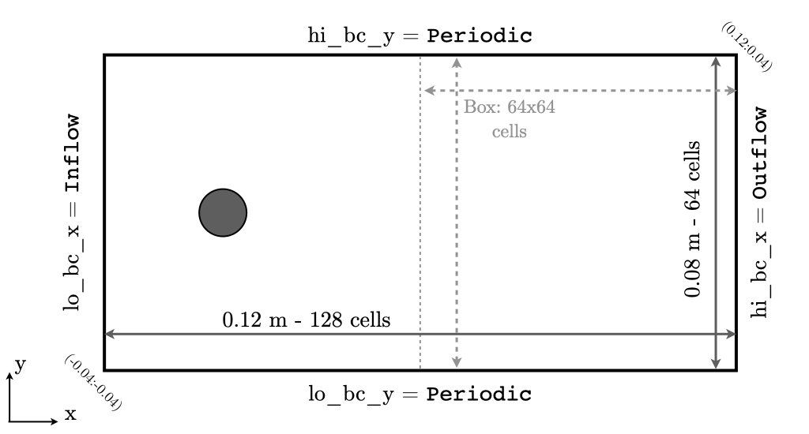
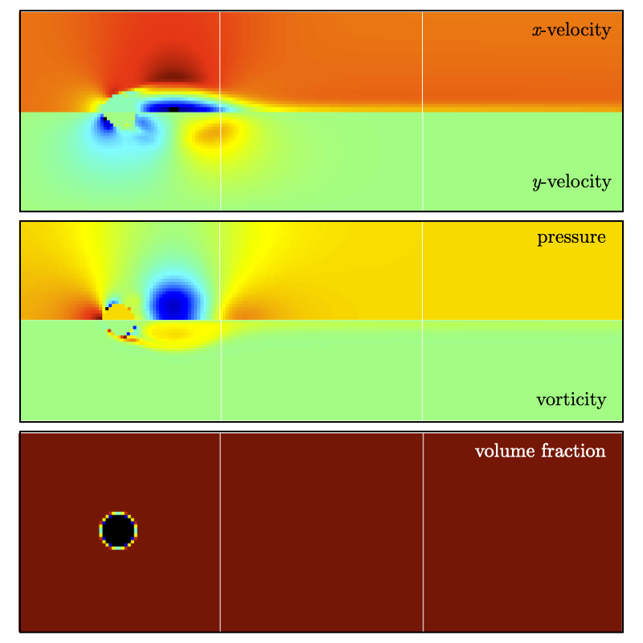
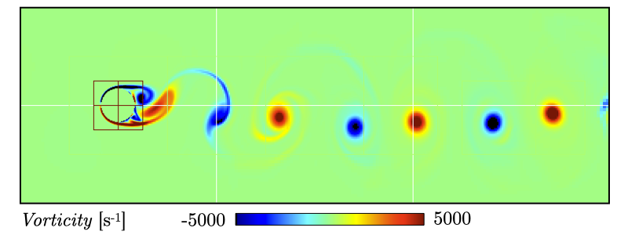

.. highlight:: rst

.. _sec:tutorialFlowPastCyl:

Tutorial - Non-reacting flow past a cylinder
================================

.. _sec:TUTO_FPC::Intro:

Introduction
------------------------------

`PeleLM` enables the representation of complex non-Cartesian
geometries using an embedded boundary (EB) method. This method relies on intersecting an
arbitrary surface with the Cartesian matrix of uniform cells, and modifies the numerical stencils
near cells that are cut by the EB. 

The goal of this tutorial is to setup a simple 2-dimentional flow past cylinder case in `PeleLM`. 
This document provides step by step instructions to properly set-up the domain and boundary conditions, 
construct an initial solution.

..  _sec:TUTO_FPC::PrepStep:

Setting-up your environment
---------------------------

PeleProduction
^^^^^^^^^^^^^^^^^^^^^^^^^^^^^^^^^^^^^
As explained in section :ref:`sec:QUICKSTART`, `PeleLM` relies on a number of supporting softwares: 

- `AMReX` is a software frameworks that provides the data structure and enable massive parallelization.
- `IAMR` is a parallel, adaptive mesh refinement (AMR) code that solves the variable-density incompressible Navier-Stokes equations.
- `PelePhysics` is a repository of physics databases and implementation code. In particular, the choice of chemistry and transport models as well as associated functions and capabilities are managed in `PelePhysics`.

All of these codes have their own development cycle, and it can make the setup of a `PeleLM` run a bit tricky.
To simplify the process, `PeleProduction <https://github.com/AMReX-Combustion/PeleProduction>`_ will be employed. `PeleProduction` is a collection of run folders for various `Pele` codes and processing. It includes git submodules for the dependent codes 
(such as `PeleLM`, `PelePhysics`, `AMReX`, etc), that can be frozen to a particular commit. 
This organizational strategy enables to manage the interactions between the various dependent repositories 
(to keep them all compatible with each other).

Step by step instructions 
^^^^^^^^^^^^^^^^^^^^^^^^^^^^^^^^^^^^^
First, make sure that "git" is installed on your machine---we recommend version 1.7.x or higher.
Then, follow these few steps to setup your run environment:

1. Download the `PeleProduction` repository and : ::

    git clone https://github.com/AMReX-Combustion/PeleProduction.git 

    cd PeleProduction 

2. Switch to the TripleFlame branch : ::

    git checkout -b Tutorials remotes/origin/Tutorials 

3. The first time you do this, you will need to tell git that there are submodules. Git will look at the ``.gitmodules`` file in this branch and use that : ::

    cd Submodules
    git submodule init 

4. Finally, get the correct commits of the sub-repos set up for this branch: ::

    git submodule update

You are now ready to build the ``FlowPastCylinder`` case associated with this branch. To do so: ::

   cd ../Tutorials/FlowPastCylinder

And follow the next steps !

Numerical setup
-----------------------

In this section we review the content of the various input files for the flow past cylinder test case. To get additional information about the keywords discussed, the user is referred to section :ref:`sec:control`.

Test case and boundary conditions
^^^^^^^^^^^^^^^^^^^^^^^^^^^^^^^^^^^
Direct Numerical Simulations (DNS) is performed on a 12x4 :math:`cm^2` 2D computational domain, with the bottom left corner located at (-0.02:-0.02) and the top right corner at (0.10:0.02). 
The base grid is decomposed into 192x64 cells and up to 3 levels of refinement (although we will start with a single level).
The refinement ratio between each level is set to 2.
The maximum box size is fixed at 64, and the base (level 0) grid is composed of 3 boxes, 
as shown in Fig :numref:`fig:FPC_NumSetup`.

Periodic boundary conditions are used in the transverse (:math:`y`) direction, while ``Inflow`` (dirichlet) and ``Outflow`` (neumann) boundary conditions are used in the main flow direction (:math:`x`). The flow goes from left to right.
A cylinder of radius 0.0035 m is placed in the middle of the flow at (0.0:0.0).

.. _fig:FPC_NumSetup:

.. table:: Sketch of the computational domain with level 0 box decomposition.
     :align: center

     +---------+
     | |FPC_a| |
     +---------+

The geometry of the problem is specified in the first block of the ``inputs.2d-regt_VS``: ::

   #----------------------DOMAIN DEFINITION------------------------                                                                        
   geometry.is_periodic = 0 0             # Periodicity in each direction: 0 => no, 1 => yes
   geometry.coord_sys   = 0               # 0 => cart, 1 => RZ
   geometry.prob_lo     = -0.02 -0.02     # x_lo y_lo
   geometry.prob_hi     =  0.10  0.02     # x_hi y_hi

The second block determines the boundary conditions. Note that `Interior` is used to indicate periodic boundary conditions. Refer to Fig :numref:`fig:FPC_NumSetup`: ::

   # >>>>>>>>>>>>>  BC FLAGS <<<<<<<<<<<<<<<<
   # Interior, Inflow, Outflow, Symmetry,
   # SlipWallAdiab, NoSlipWallAdiab, SlipWallIsotherm, NoSlipWallIsotherm
   peleLM.lo_bc = Inflow   SlipWallAdiab
   peleLM.hi_bc = Outflow  SlipWallAdiab

In the present case, the EB geometry is a simple cylinder (or sphere) which is readily available from the `AMReX` library and only a few paremeters need to be specified by the user. This is done further down in the input file: ::

   #------------  INPUTS FOR EMBEDED BOUNDARIES ----------------
   eb2.geom_type                    = sphere
   eb2.sphere_radius                = 0.0035
   eb2.sphere_center                = 0.00 0.00
   eb2.sphere_has_fluid_inside      = 0 
   eb2.small_volfrac                = 1.0e-4

Note that the last parameter is used to specify a volume fraction (ratio of the uncovered surface (2D) or volume (3D) over the cell surface or volume) threshold below which a cell is considered fully covered. This prevents the appearance of extremely small partially covered cells which are numerically unstable.

The number of levels, refinement ratio between levels, maximium grid size as well as other related refinement parameters are set under the third block  : ::

   #-------------------------AMR CONTROL----------------------------
   amr.n_cell          = 192 64     # Level 0 number of cells in each direction
   amr.v               = 1          # amr verbosity level
   amr.max_level       = 0          # maximum level number allowed
   amr.ref_ratio       = 2 2 2 2    # refinement ratio
   amr.regrid_int      = 2          # how often to regrid
   amr.n_error_buf     = 2 2 2 2    # number of buffer cells in error est
   amr.grid_eff        = 0.7        # what constitutes an efficient grid
   amr.blocking_factor = 16         # block factor in grid generation
   amr.max_grid_size   = 64         # maximum box size

..  _sec:TUTO_FPC::InflowSpec:

Problem specifications
^^^^^^^^^^^^^^^^^^^^^^

This very simple problem only has three user-defined problem parameters: the inflow velocity magnitude, the pressure and the temperature. This setup is also constructed to be able to perform the simulation of mixture perturbation crossing over the cylinder so that a switch is available to run this case rather than the simple vortex shedding past a cylinder.
Specifying dirichlet ``Inflow`` conditions in `PeleLM` can seem daunting at first. But it is actually a very flexible process. We walk the user through the details which involve the following files:

- ``pelelm_prob_parm.H``, assemble in a C++ struct ``ProbParm`` the input variables as well as other variables used in the initialization process.
- ``pelelm_prob.cpp``, initialize and provide default values to the entries of ``ProbParm`` and allow the user to pass run-time value using the `AMReX` parser (``ParmParse``). In the present case, the parser will read the parameters in the ``PROBLEM PARAMETERS`` block: ::

    prob.type         = VortexShedding
    prob.meanFlowMag  = 3.0
  
- finally, ``pelelm_prob.H`` contains the ``pelelm_initdata`` and ``bcnormal`` functions responsible for generating the initial and boundary conditions, respectively.

Note that in the present case, the default values of pressure and temperature are employed since their respective keywords are not specified in the input file.

Finally, this test uses a constant set of transport parameters rather relying on the EGLib library 
(see :ref:`sec:model:EqSets` for more details on EGLib). These transport parameters are specified in the ``CONSTANT TRANSPORT`` block: ::

    #------------  INPUTS TO CONSTANT TRANSPORT -----------------
    transport.const_viscosity        = 2.0e-04
    transport.const_bulk_viscosity   = 0.0 
    transport.const_conductivity     = 0.0 
    transport.const_diffusivity      = 0.0 

Only the viscosity in the present case, and note that CGS units are employed while specifying these properties. 
Using these parameters, it is possible to evaluate the Reynolds number, based on the inflow velocity and the cylinder diameter:

.. math::

   Re = \frac{\rho U_{inf} D}{\mu} = \frac{1.175 * 3 * 0.007}{2.0e-05} \sim 1200 

This relatively high value ensures that the flow will exhibit vortex shedding.

Initial solution
^^^^^^^^^^^^^^^^^^^^^

An initial field of the main variables is always required to start a simulation. In the present case, the computational domain is filled with air in the condition of pressure and temperature provided by the user (or the default ones). An initial constant velocity of ``meanFlowMag`` is used, but note that `PeleLM` performs an initial velocity projection to enforce the low Mach number constraint which overwrite this initial velocity.

This initial solution is constructed via the routine ``pelelm_initdata()``, in the file ``pelelm_prob.H``. Additional information is provided as comments in this file for the eager reader, but nothing is required from the user at this point.

Numerical scheme
^^^^^^^^^^^^^^^^^^^^^

The ``NUMERICS CONTROL`` block can be modified by the user to increase the number of SDC iterations. Note that there are many other parameters controlling the numerical algorithm that the advanced user can tweak, but we will not talk about them in the present Tutorial. The interested user can refer to section :ref:`sec:control:pelelm`.

Building the executable
----------------------------------

The last necessary step before starting the simulation consists of building the PeleLM executable. AMReX applications use a makefile system to ensure that all the required source code from the dependent libraries be properly compiled and linked. The ``GNUmakefile`` provides some compile-time options regarding the simulation we want to perform.
The first line can be modified to specify the absolute path to the `PeleProduction` directory while the next four lines specify the paths towards the source code of `PeleLM`, `AMReX`, `IAMR` and `PelePhysics` and should not be changed. 

Next comes the build configuration block: ::

   #
   # Build configuration
   #

   # AMREX options
   DIM             = 2
   USE_EB          = TRUE

   # Compiler / parrallel paradigms
   COMP            = gnu 
   USE_MPI         = TRUE
   USE_OMP         = FALSE
   USE_CUDA        = FALSE
   USE_HIP         = FALSE

   # MISC options
   DEBUG           = FALSE
   PRECISION       = DOUBLE
   VERBOSE         = FALSE
   TINY_PROFILE    = FALSE

It allows the user to specify the number of spatial dimensions (2D), trigger the compilation of the EB source code, the compiler (``gnu``) and the parallelism paradigm (in the present case only MPI is used). The other options can be activated for debugging and profiling purposes.

In `PeleLM`, the chemistry model (set of species, their thermodynamic and transport properties as well as the description of their of chemical interactions) is specified at compile time. Chemistry models available in `PelePhysics` can used in `PeleLM` by specifying the name of the folder in `PelePhysics/Support/Fuego/Mechanisms/Models` containing the relevant files, for example: ::

   Chemistry_Model = air
   
Here, the model ``air``, only contains 2 species (O2 and N2). The user is referred to the `PelePhysics <https://pelephysics.readthedocs.io/en/latest/>`_ documentation for a list of available mechanisms and more information regarding the EOS, chemistry and transport models specified: ::

    Eos_dir       := Fuego
    Reactions_dir := Null
    Transport_dir := Constant

You are now ready to build your first `PeleLM` executable !! Type in: ::

    make -j4

The option here tells `make` to use up to 4 processors to create the executable (internally, `make` follows a dependency graph to ensure any required ordering in the build is satisfied). This step should generate the following file (providing that the build configuration you used matches the one above): ::

    PeleLM2d.gnu.MPI.ex

You're good to go !

Running the problem on a coarse grid
----------------------------------

As a first step towards obtaining the classical Von-Karman alleys, we will now let the flow establish using only the coarse base grid. The simulation will last for 50 ms.

Time-stepping parameters in ``input.2d-regt`` are specified in the ``TIME STEPING CONTROL`` block: ::

    #----------------------TIME STEPING CONTROL----------------------
    max_step       = 300000          # Maximum number of time steps
    stop_time      = 0.05            # final physical time
    ns.cfl         = 0.3             # cfl number for hyperbolic system
    ns.init_shrink = 1.0             # scale back initial timestep
    ns.change_max  = 1.1             # max timestep size increase
    ns.dt_cutoff   = 5.e-10          # level 0 timestep below which we halt

The final simulation time is set to 0.05 s. `PeleLM` solves for the advection, diffusion and reaction processes in time, but only the advection term is treated explicitly and thus it constrains the maximum time step size :math:`dt_{CFL}`. This constraint is formulated with a classical Courant-Friedrich-Levy (CFL) number, specified via the keyword ``ns.cfl``.
Additionally, as it is the case here, the initial solution is often made-up by the user and local mixture composition and temperature can result in the introduction of unreasonably fast chemical scales.
To ease the numerical integration of this initial transient, the parameter ``ns.init_shrink`` allows to shrink the inital `dt` (evaluated from the CFL constraint) by a factor (usually smaller than 1), and let it relax towards :math:`dt_{CFL}`at a rate given by ``ns.change_max`` as the simulation proceeds. Since the present case does not involve complex chemiscal processes, this parameter is kept to 1.0.

Input/output from `PeleLM` are specified in the ``IO CONTROL`` block: ::

    #-------------------------IO CONTROL----------------------------
    amr.checkpoint_files_output = 1   # Dump check file ? 0: no, 1: yes
    amr.check_file      = chk_        # root name of checkpoint file
    amr.check_per       = 0.05        # frequency of checkpoints
    amr.plot_file       = plt_        # root name of plotfiles   
    amr.plot_per        = 0.005       # frequency of plotfiles
    amr.derive_plot_vars=rhoRT mag_vort avg_pressure gradpx gradpy
    amr.grid_log        = grdlog      # name of grid logging file

Information pertaining to the checkpoint and plot_file files name and output frequency can be specified there.
We have specified here that a checkpoint file will be generated every 50 ms and a plotfile every 5 ms. `PeleLM` will always generate an initial plotfile ``plt_00000`` if the initialization is properly completed, and a final plotfile at the end of the simulation. It is possible to request including `derived variables` in the plotfiles by appending their names to the ``amr.derive_plot_vars`` keyword. These variables are derived from the `state variables` (velocity, density, temperature, :math:`\rho Y_k`, :math:`\rho h`) which are automatically included in the plotfile.

You finally have all the information necessary to run the first of several steps. Type in: ::

    ./PeleLM2d.gnu.MPI.ex inputs.2d-regt_VS

A lot of information is printed directly on the screen during a `PeleLM` simulation, but it will not be detailed in the present tutorial. If you wish to store these information for later analysis, you can instead use: ::

    ./PeleLM2d.gnu.MPI.ex inputs.2d-regt_VS > logCoarseRun.dat &
    
Whether you have used one or the other command, the computation finishes within a couple of minutes and you should obtain a set of ``plt_****`` files (and maybe a set appended with .old*********** if you used both commands). Use `Amrvis <https://amrex-codes.github.io/amrex/docs_html/Visualization.html>`_ to vizualize the results. Use the following command to open the entire set of solutions: ::

   amrvis -a plt_?????

.. _fig:FPC_Coarse:

.. table:: Contour plots of velocity components, vorticity, pressure and volume fraction at t = 50 ms on the coarse grid.
     :align: center

     +---------+
     | |FPC_b| |
     +---------+

At this point, you have established a flow with a large recirculation zone in the wake of the cylinder, but the flow has not yet fully transitioned to periodic vortex shedding.
The flow is depicted in Fig :numref:`fig:FPC_Coarse` showing a few of the available contour plots at 50 ms. Note that the value of the fully covered cells is set to zero.

As can be seen from Fig :numref:`fig:FPC_Coarse`, the flow has not yet transitioned to the familiar Von-Karman alleys and two aspects of the current simulation can delay or even prevent the onset of vortex shedding:

 - the flow is initially symmetric and the transition to the familiar periodic flow is due to the growth of infinitesimal perturbations in the shear layer of the wake. Because the flow is artificially too symmetric, this transition can be delayed until round-off errors sufficiently accumulate.
 - the numerical dissipation introduced by this coarse grid results in an effective Reynolds number probably significantly lower than the value estimated above.

Before adding refinement levels, we will first pursue the simulation until the flow reaches a periodic vortex shedding state. To do so, restart the simulation from the checkpoint file generated at the end of the first run and set the final simulation time to 200 ms: ::
   
    #-------------------------IO CONTROL----------------------------
    ...
    amr.restart             = chk_01327 # Restart from checkpoint ?

    ...

    #----------------------TIME STEPING CONTROL----------------------
    ...
    stop_time      = 0.20            # final physical time

and restart the simulation ::

    ./PeleLM2d.gnu.MPI.ex inputs.2d-regt_VS > logCoarseRun2.dat &

The flow has now fully transition and you can use Amrvis to visualize the serie of vortex in the wake of the cylinder. In the next step, we will add finer grid patches around the EB geometry and in high vorticity regions.

Refinement of the computation
-----------------------------

We will now add a first level of refinement. In the present simulation, the refinement criteria could be based on several characteristics of the flow: velocity gradients, vorticity, pressure, ... In the following, we will simply use vorticity.
Additionally, by construction the geometry must be built to the finest level which act as a refinement criteria based on the gradient of volume fraction. This is beneficial in this case in order to help refine the cylinder boundary layer.
Start by increasing the number of AMR levels to one in the ``AMR CONTROL`` block: ::

    amr.max_level       = 1          # maximum level number allowed

Then provide a definition of the new refinement critera in the ``REFINEMENT CONTROL`` block: ::

    #--------------------REFINEMENT CONTROL------------------------
    # Refinement according to the vorticity, no field_name needed
    amr.refinement_indicators     = lowvort highvort
    amr.lowvort.max_level         = 1
    amr.lowvort.value_less        = -1000 
    amr.lowvort.field_name        = mag_vort
    
    amr.highvort.max_level         = 1
    amr.highvort.value_greater     = 1000 
    amr.highvort.field_name        = mag_vort

    # Refine the EB
    ns.refine_cutcells            = 1 

The first line simply declares a set of refinement indicators which are subsequently defined. For each indicator, the user can provide a limit up to which AMR level this indicator will be used to refine. Then there are multiple possibilities to specify the actual criterion: ``value_greater``, ``value_less``, ``vorticity_greater`` or ``adjacent_difference_greater``. In each case, the user specify a threshold value and the name of variable on which it applies (except for the ``vorticity_greater``).
In the example above, the grid is refined up to level 1 at the location where the vorticity magnitude is above 1000 :math:`s^{-1}` as well as on the cut cells (where the cylinder intersect with the edges of cell).  Note that in the present case, the ``vorticity_greater`` was not used to ensure that regions of both low and high vorticity are refined.

With these new parameters, change the `checkpoint` file from which to restart and allow regridding upon restart by updating the following lines in the ``IO CONTROL`` block: ::

    amr.restart             = chk_06195 # Restart from checkpoint ?
    amr.regrid_on_restart   = 1

, increase the `stop_time` to 300 ms in the ``TIME STEPING CONTROL`` block: ::

    stop_time      = 0.30            # final physical time

and start the simulation again (using multiple processor if available) ::

    mpirun -n 4 ./PeleLM2d.gnu.MPI.ex inputs.2d-regt_VS > log2Levels.dat &

Once again, use Amrvis to visualize the effects of refinement: after an initial transient, the flow return to a smooth periodic vortex shedding and the boundary layer of the cylinder is now significantly better captured but still far from fully refined.
As a final step, we will add another level of refinement, only at the vicinity of the cylinder since the level 1 resolution appears sufficient to discretize the vortices in the wake. To do so, simply allow for another level of refinement: ::

    amr.max_level       = 2          # maximum level number allowed

and since the vorticity refinement criterion only refine up to level 1, the level 2 will only be located around the EB. Update the `checkpoint` file in the ``IO CONTROL`` block, increase the `stop_time` to 350 ms in the the ``TIME STEPING CONTROL`` and restart the simulation: ::

    mpirun -n 4 ./PeleLM2d.gnu.MPI.ex inputs.2d-regt_VS > log3Levels.dat &

You should obtain a flow with a vorticity field similar to Fig. :numref:`fig:FPC_VortFinal`.
For the purpose of the present tutorial, this will be our final solution but one can see that the flow has not yet return to a periodic vortex shedding and additinal resolution could be added locally to obtain smoother flow features.

.. _fig:FPC_VortFinal:

.. table:: Contour plots of vorticit at t = 350 ms with 2 levels of refinements.
     :align: center

     +---------+
     | |FPC_c| |
     +---------+
